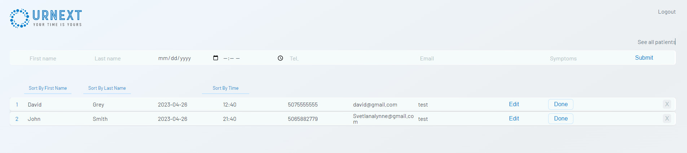
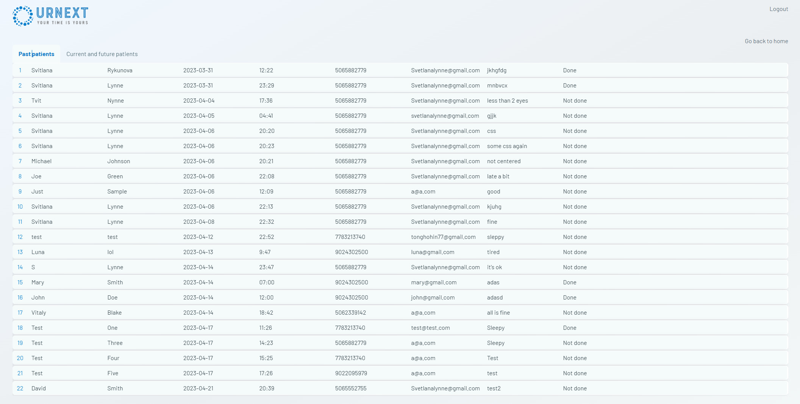
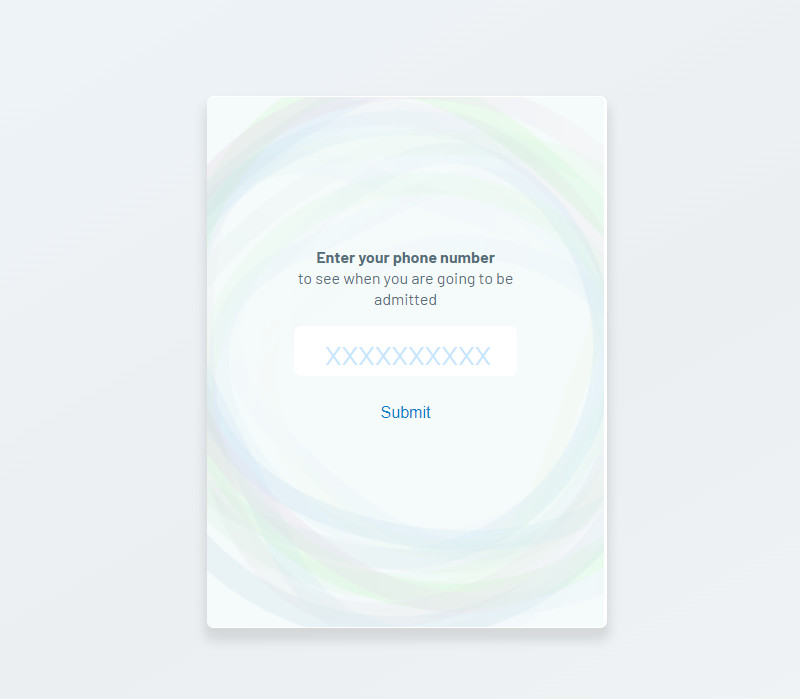
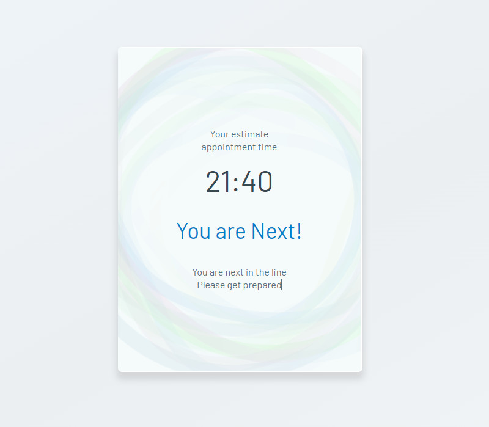
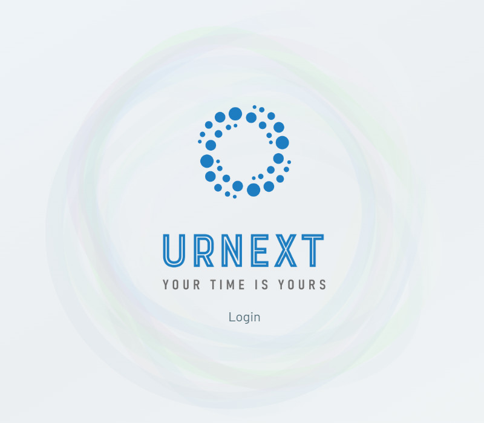

**Ur-Next**

UrNext is an online application designed to send SMS notifications to patients informing them when they are close to or next in line to see a doctor.
It was created through collaborative work by four students of the Full-Stack Development program at a Community college.

## Purpose and Features

Even if the time of appointment is scheduled, it is quite common for patients to wait in line for extended periods, which can range from one to seven hours.
Being able to receive notifications and check how much time is left until admission into the clinic would be very convenient.
Initially developed for clinics, UrNext has many other potential applications in various service sectors, such as restaurants, mechanics, or public services.

During the registration process, patients or clients provide their phone number, and when there are fewer than three people in line ahead of them,
the application sends an SMS with the approximate appointment time and the number of people in the queue. UrNext is managed by medical specialists,
such as administrators or receptionists, and has a patient registration form that displays past, current, and future appointments.
The queue is also managed by the medical staff, who can mark a patient as "Done" when their appointment has finished.

## Tools

The Front-End component was developed using React.js and pure CSS
The Back-End functionality was realized with Node.js, Express, and Multer.
MongoDB, managed with Mongoose, serves as the database.
Authentication was established through integration with the Google Firebase SDK.

## Screenshots

